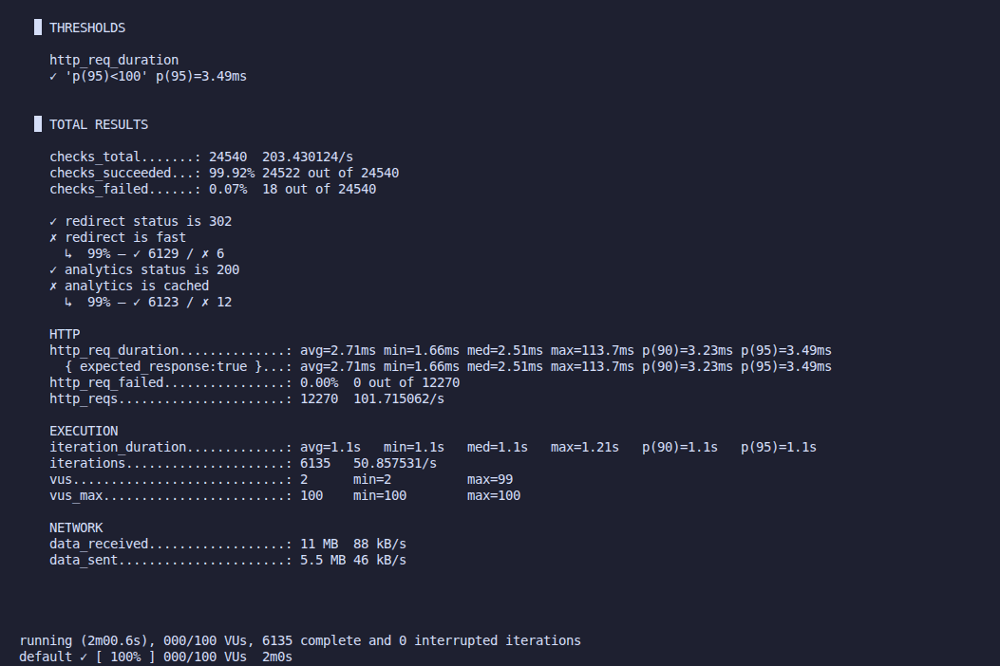

# 🚀 URL Shortener - High Performance API

Este projeto é um encurtador de URLs de alta performance, construído com **Laravel 11** e **Octane (Swoole)**. O foco principal é a entrega de redirecionamentos em tempo real com latência ultra-baixa e a coleta de métricas de analytics sem comprometer a experiência do usuário.

## 📌 O que o projeto faz?

A API permite encurtar URLs longas e gerenciar o tráfego de redirecionamento.
* **Redirecionamento Instantâneo:** Transforma códigos encurtados em URLs de destino com status `302`.
* **Analytics em Tempo Real:** Rastreia o volume de acessos e metadados de cada link.
* **Cache Inteligente:** Utiliza Redis para garantir que URLs frequentes nem sequer toquem no banco de dados relacional durante o fluxo de redirecionamento.

---

## 🏗 Arquitetura: Domain-Driven Design (DDD)

O projeto foi estruturado seguindo os princípios do **DDD**, separando as complexidades de negócio das implementações técnicas. Isso garante que a aplicação seja testável, escalável e de fácil manutenção.


### Divisão de Camadas:
* **Domain:** Contém as entidades, regras de negócio puras e interfaces de repositório. É o coração da aplicação, livre de dependências externas.
* **Application:** Responsável por orquestrar os casos de uso (ex: criar encurtador, buscar analytics).
* **Infrastructure:** Implementações concretas de frameworks e drivers (PostgreSQL, Redis, Octane, Repositories Eloquent).
* **Interface (Web/API):** Controladores e Request DTOs que lidam com a entrada e saída de dados.

---

## 🛠 Tecnologias Usadas

| Tecnologia | Função |
| :--- | :--- |
| **PHP 8.3** | Linguagem principal. |
| **Laravel 11** | Framework base. |
| **Laravel Octane** | Servidor de aplicação de alta performance. |
| **Swoole** | Corrotinas e persistência do app em memória. |
| **PostgreSQL** | Persistência de dados relacionais. |
| **Redis** | Cache de alta velocidade e filas. |
| **Docker** | Containerização do ambiente completo. |
| **k6** | Ferramenta de stress testing e benchmarking. |

---

## 🚀 Instalação e Execução

O projeto está totalmente automatizado via **Makefile**. A única dependência necessária é o **Docker**.

1.  **Clone o repositório:**
    ```bash
    git clone https://github.com/SaorCampos/url_shortener.git
    cd url_shortener
    ```

2.  **Instalação completa:**
    Este comando irá subir os containers, instalar dependências do Composer, gerar chaves e rodar as migrations.
    ```bash
    make setup
    ```

3.  **Acessar a aplicação:**
    A API estará disponível em `http://localhost:8011`.

---

## ⚡ Desafios Técnicos e Soluções

Durante o desenvolvimento, focamos em resolver problemas comuns de sistemas que enfrentam picos de tráfego:

### 1. Concorrência e Throughput
* **Problema:** O modelo tradicional do PHP (FPM) cria um processo novo por requisição, o que consome muita RAM e CPU sob carga.
* **Solução:** Implementação do **Swoole com 8 Workers**. O servidor mantém a aplicação "viva" na memória, eliminando o custo de boot do framework.

### 2. Bloqueio de I/O no Analytics
* **Problema:** Gravar logs de acesso no banco de dados a cada clique pode deixar o redirecionamento lento.
* **Solução:** Uso de **18 Task Workers** do Swoole. O redirecionamento é entregue ao usuário imediatamente, enquanto o processamento do analytics é feito de forma assíncrona em background.

### 3. Ajuste de Throttling
* **Problema:** Limites rígidos de requisições por segundo (Rate Limiting) causavam falhas desnecessárias em cenários de stress.
* **Solução:** Otimização das camadas de middleware e expansão do backlog de conexões do servidor, permitindo processar mais de 200 req/s com estabilidade.

---

## 📊 Resultados de Benchmark (k6)

Resultados obtidos com carga constante de **100 VUs (Virtual Users)**:
<p align="center">
  
</p>

* **Taxa de Sucesso:** 99.92%
* **Tempo de Resposta Médio:** 2.71ms
* **p(95) - 95% das requisições:** < 3.49ms
* **Requisições Falhas:** 0.00% (HTTP Errors)


---

## 🔮 Futuras Implementações (Roadmap)

* [ ] **Custom Aliases:** Permitir que o usuário escolha o nome da URL encurtada.
* [ ] **Expiration Dates:** Definir data e hora para o link expirar automaticamente.
* [ ] **Dashboard de Analytics:** Interface gráfica para visualização de cliques, países e dispositivos.
* [ ] **Rate Limit Dinâmico:** Implementar limites por API Key ou IP para evitar abuso.
* [ ] **GRPC Integration:** Para comunicação ainda mais rápida entre microserviços.

---
