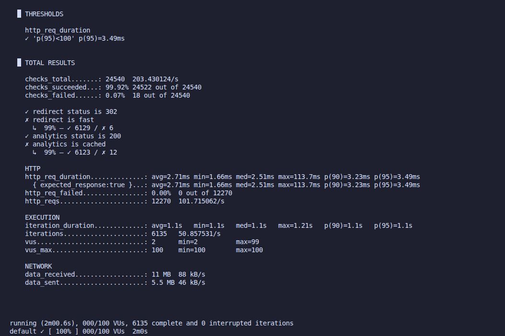
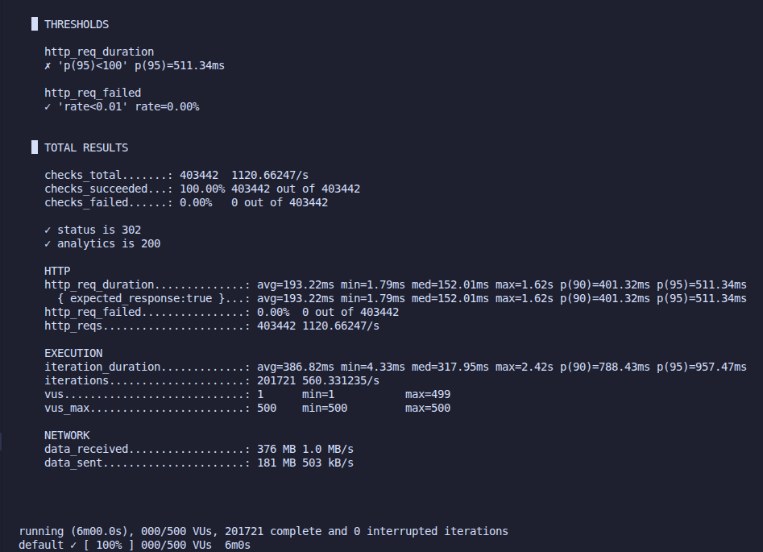

# 🚀 URL Shortener - High Performance API

---
# PT-BR

Este é um encurtador de URLs de ultra-alta performance, construído com **Laravel 11** e **Octane (Swoole)**. O projeto foi desenhado para cenários de tráfego massivo, utilizando processamento assíncrono e arquitetura resiliente para garantir latência sub-5ms.

## 📌 Funcionalidades Core
* **Redirecionamento Instantâneo:** Respostas `302` ultra-rápidas com cache em Redis.
* **Analytics Assíncrono:** Coleta de métricas sem impactar o tempo de resposta do usuário.
* **Arquitetura DDD:** Código limpo, testável e desacoplado de infraestrutura.

## ⚡ Performance Benchmarks (k6)

### Load Test (100 VUs)
Focado em estabilidade e experiência do usuário.
* **p(95):** < 3.5ms
* **Taxa de Sucesso:** 99.92%

### Stress Test (500 VUs - Full Load)
Focado em encontrar o limite de vazão da infraestrutura.
* **Throughput:** 1.120 req/s
* **Taxa de Sucesso:** 100% (Zero falhas sob estresse máximo)

---

## 🚀 Como Rodar

O projeto utiliza um **Makefile** para automatizar todo o setup via Docker.

1. **Instalação:** `make setup`
2. **Acessar:** `http://localhost:8011`

> 📖 **Quer entender a engenharia por trás desses números?** > Confira o [Guia de Arquitetura e Decisões Técnicas](docs/architecture.md).

> 📘 **Documentação OpenAPI**: O contrato completo da API pode ser visualizado no arquivo [openapi.yaml](docs/openapi.yaml). Você pode colar o conteúdo deste arquivo no [Swagger Editor](https://editor.swagger.io/) para testar a interface.

---

## 🔮 Roadmap
* [ ] **Custom Aliases:** Permitir que o usuário escolha o nome da URL encurtada.
* [ ] **Expiration Dates:** Definir data e hora para o link expirar automaticamente.
* [ ] **Dashboard de Analytics:** Interface gráfica para visualização de cliques, países e dispositivos.
* [ ] **Rate Limit Dinâmico:** Implementar limites por API Key ou IP para evitar abuso.
* [ ] **GRPC Integration:** Para comunicação ainda mais rápida entre microserviços.

---

# EN-US

This is a high-performance URL shortener built with **Laravel 11** and **Octane (Swoole)**. The project is designed for massive traffic scenarios, using asynchronous processing and a resilient architecture to ensure sub-5ms latency.

## 📌 Core Features

* **Instant Redirection:** Ultra-fast `302` responses with Redis caching.
* **Asynchronous Analytics:** Collecting metrics without impacting user response times.
* **DDD Architecture:** Clean, testable code decoupled from infrastructure.

## ⚡ Performance Benchmarks (k6)

### Load Test (100 VUs)

Focused on stability and user experience.

* **p(95):** < 3.5ms
* **Success Rate:** 99.92%

### Stress Test (500 VUs - Full Load)

Focused on finding the throughput limits of the infrastructure.

* **Throughput:** 1,120 req/s
* **Success Rate:** 100% (Zero failures under maximum stress)

---

## 🚀 How to Run

The project uses a **Makefile** to automate the entire setup via Docker.

1. **Installation:** `make setup`
2. **Access:** `http://localhost:8011`

> 📖 **Want to understand the engineering behind these numbers?** > Check out the [Architecture and Technical Decisions Guide](docs/architecture.md).

> 📘 **OpenAPI Documentation**: The complete API contract can be viewed in the [openapi.yaml](docs/openapi.yaml) file. You can paste the content of this file into the [Swagger Editor](https://editor.swagger.io/) to test the interface.

---

## 🔮 Roadmap

* [ ] **Custom Aliases:** Allow users to choose the name of the shortened URL.
* [ ] **Expiration Dates:** Set date and time for the link to automatically expire.
* [ ] **Analytics Dashboard:** Graphical interface for viewing clicks, countries, and devices.
* [ ] **Dynamic Rate Limiting:** Implement limits by API Key or IP to prevent abuse.
* [ ] **GRPC Integration:** For even faster communication between microservices.

---
