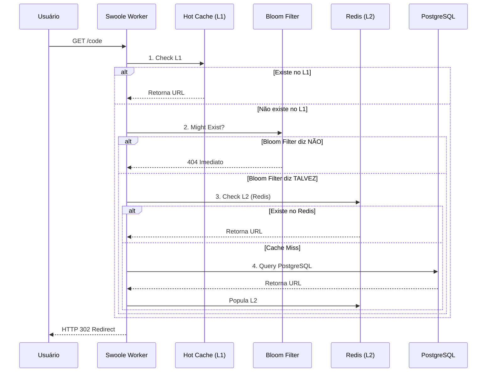
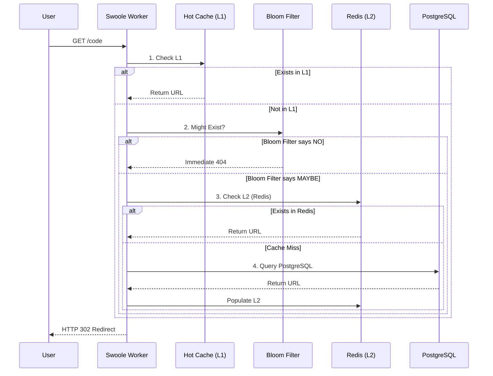

# PT-BR

# 🏗 Engenharia e Arquitetura

Este documento detalha as decisões de design e infraestrutura que permitem ao projeto sustentar mais de 2.000 requisições por segundo em uma única instância.

## 🏛 Domain-Driven Design (DDD)

A aplicação segue os princípios do DDD para separar a complexidade de negócio dos detalhes de implementação.

### Camadas do Sistema:
1. **Domain:** Contém as Entidades de Negócio (ex: `ShortenedUrl`), Value Objects e as interfaces dos Repositórios. É 100% agnóstico a frameworks.
2. **Application:** Contém os Casos de Uso (ex: `CreateShortUrl`, `GetAnalytics`). Orquestra a lógica sem conhecer detalhes de persistência.
3. **Infrastructure:** Implementações técnicas. Aqui reside o Eloquent, drivers de Redis, e a integração com o Swoole Tasks.
4. **Interface (Web/API):** Controladores que recebem o input, validam via DTOs e retornam as respostas HTTP.

## ⚡ Otimização de Performance

### 1. Modelo de Concorrência (Swoole)
Utilizamos o **Laravel Octane com Swoole** configurado com **8 Workers**.
* **Decisão:** O número de workers foi definido para coincidir 1:1 com a quantidade de núcleos físicos da CPU de teste.
* **Impacto:** Isso maximiza o paralelismo real e reduz o *Context Switching* do Sistema Operacional, garantindo que cada núcleo processe uma requisição por vez sem interrupções.

### 2. Processamento Assíncrono de Analytics
Um dos maiores gargalos de um encurtador é gravar o log de acesso no banco de dados. 
* **Solução:** Utilizamos o `Octane::task()`. Quando um redirecionamento ocorre, o Worker principal envia os dados para um **Task Worker** e retorna a resposta 302 imediatamente para o usuário.
* **Resultado:** A escrita no PostgreSQL ocorre em background, removendo o I/O do banco de dados do caminho crítico da requisição.

### 3. Estratégia de Caching Multicamadas
Para evitar o Cache Stampede e proteger o banco de dados contra requisições inválidas, implementamos uma hierarquia de proteção:

* L1 - Hot Cache (Memory): Armazenamento em memória local do worker (via Swoole Table ou Array estático) para as URLs mais acessadas, reduzindo latência de rede para o Redis.

* L2 - Redis (Distributed): Cache global com TTL configurado, servindo como a fonte principal de verdade para o estado da aplicação.

* Bloom Filter (Probabilistic Shield): Antes de qualquer consulta ao PostgreSQL para chaves inexistentes, consultamos um Bloom Filter no Redis. Se o filtro retornar false, a requisição é rejeitada imediatamente como 404, sem nunca tocar no banco de dados.

Impacto: Proteção total contra ataques de enumeração ou buscas massivas por códigos inexistentes.

### 4. 🛡 Resiliência e Tolerância a Falhas
A aplicação foi desenhada para "falhar graciosamente" (graceful degradation):

* Circuit Breaker Mental: Se o Redis estiver indisponível, o CachedShortUrlRepository captura a exceção e direciona a busca automaticamente para o PostgreSQL, garantindo que o serviço continue online mesmo com degradação de performance.

* Shadow Logging: Erros em tarefas de analytics (Task Workers) são reportados, mas nunca interrompem o redirecionamento do usuário final.

## 🔄 Fluxo da Requisição

---

# EN-US

# 🏗 Engineering and Architecture

This document details the design and infrastructure decisions that allow the project to handle over 2,000 requests per second on a single instance.

## 🏛 Domain-Driven Design (DDD)

The application follows the principles of DDD to separate business complexity from implementation details.

### System Layers:

1. **Domain:** Contains the Business Entities (e.g., `ShortenedUrl`), Value Objects, and Repository interfaces. It is 100% agnostic to frameworks.
2. **Application:** Contains Use Cases (e.g., `CreateShortUrl`, `GetAnalytics`). It orchestrates the logic without knowing persistence details.
3. **Infrastructure:** Technical implementations. This is where Eloquent, Redis drivers, and integration with Swoole Tasks reside.
4. **Interface (Web/API):** Controllers that receive input, validate via DTOs, and return HTTP responses.

## ⚡ Performance Optimization

### 1. Concurrency Model (Swoole)

We use **Laravel Octane with Swoole** configured with **8 Workers**.

* **Decision:** The number of workers was set to match the 1:1 ratio with the number of physical CPU cores on the test machine.
* **Impact:** This maximizes real parallelism and reduces *Context Switching* by the Operating System, ensuring that each core processes one request at a time without interruption.

### 2. Asynchronous Analytics Processing

One of the biggest bottlenecks in a URL shortener is logging access data to the database.

* **Solution:** We use `Octane::task()`. When a redirection occurs, the main Worker sends the data to a **Task Worker** and immediately returns a 302 response to the user.
* **Result:** Writing to PostgreSQL happens in the background, removing database I/O from the critical request path.

### 3. Multi-tier Caching Strategy
To prevent Cache Stampede and protect the database against invalid requests, we implemented a protection hierarchy:

* L1 - Hot Cache (Memory): Local worker memory storage (via Swoole Table or static arrays) for top-accessed URLs, reducing network latency to Redis.

* L2 - Redis (Distributed): Global cache with configured TTL, serving as the primary source of truth for application state.

* Bloom Filter (Probabilistic Shield): Before querying PostgreSQL for non-existent keys, we consult a Bloom Filter in Redis. If it returns false, the request is immediately rejected (404), never touching the database.

Impact: Complete protection against enumeration attacks or massive searches for non-existent codes.

### 4. 4. 🛡 Resilience and Fault Tolerance
The application is designed for "graceful degradation":

* Mental Circuit Breaker: If Redis is unavailable, the CachedShortUrlRepository catches the exception and automatically directs the search to PostgreSQL, ensuring the service remains online with a slight performance trade-off.

* Shadow Logging: Errors in analytics tasks (Task Workers) are reported but never interrupt the end-user's redirection flow.

## 🔄 Request Flow

---
