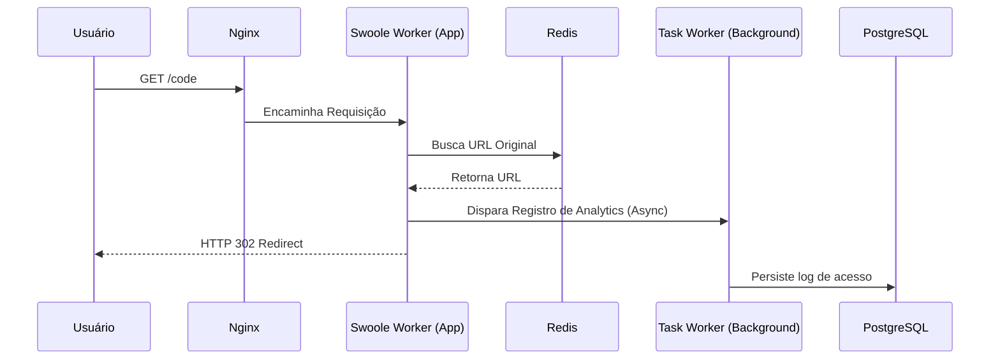
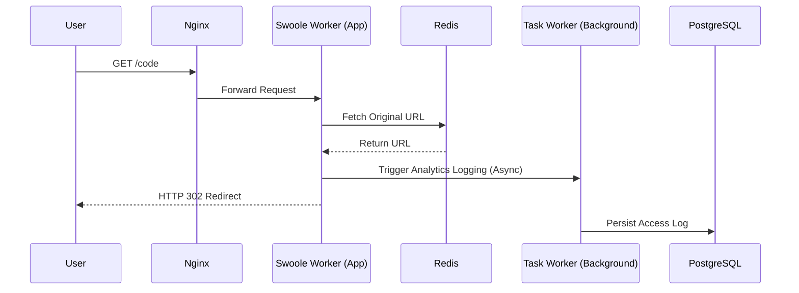

# PT-BR

# 🏗 Engenharia e Arquitetura

Este documento detalha as decisões de design e infraestrutura que permitem ao projeto sustentar mais de 1.000 requisições por segundo em uma única instância.

## 🏛 Domain-Driven Design (DDD)

A aplicação segue os princípios do DDD para separar a complexidade de negócio dos detalhes de implementação.

### Camadas do Sistema:
1. **Domain:** Contém as Entidades de Negócio (ex: `ShortenedUrl`), Value Objects e as interfaces dos Repositórios. É 100% agnóstico a frameworks.
2. **Application:** Contém os Casos de Uso (ex: `CreateShortUrl`, `GetAnalytics`). Orquestra a lógica sem conhecer detalhes de persistência.
3. **Infrastructure:** Implementações técnicas. Aqui reside o Eloquent, drivers de Redis, e a integração com o Swoole Tasks.
4. **Interface (Web/API):** Controladores que recebem o input, validam via DTOs e retornam as respostas HTTP.

## ⚡ Otimização de Performance

### 1. Modelo de Concorrência (Swoole)
Utilizamos o **Laravel Octane com Swoole** configurado com **8 Workers**.
* **Decisão:** O número de workers foi definido para coincidir 1:1 com a quantidade de núcleos físicos da CPU de teste.
* **Impacto:** Isso maximiza o paralelismo real e reduz o *Context Switching* do Sistema Operacional, garantindo que cada núcleo processe uma requisição por vez sem interrupções.

### 2. Processamento Assíncrono de Analytics
Um dos maiores gargalos de um encurtador é gravar o log de acesso no banco de dados. 
* **Solução:** Utilizamos o `Octane::task()`. Quando um redirecionamento ocorre, o Worker principal envia os dados para um **Task Worker** e retorna a resposta 302 imediatamente para o usuário.
* **Resultado:** A escrita no PostgreSQL ocorre em background, removendo o I/O do banco de dados do caminho crítico da requisição.

### 3. Estratégia de Caching
O fluxo de redirecionamento prioriza o **Redis** (Cache-Aside pattern).
1. O Worker verifica se o código existe no Redis.
2. Se existir, o redirecionamento é servido em < 2ms.
3. Se não, busca no PostgreSQL e popula o cache para as próximas requisições.

## 🔄 Fluxo da Requisição

---

# EN-US

# 🏗 Engineering and Architecture

This document details the design and infrastructure decisions that allow the project to handle over 1,000 requests per second on a single instance.

## 🏛 Domain-Driven Design (DDD)

The application follows the principles of DDD to separate business complexity from implementation details.

### System Layers:

1. **Domain:** Contains the Business Entities (e.g., `ShortenedUrl`), Value Objects, and Repository interfaces. It is 100% agnostic to frameworks.
2. **Application:** Contains Use Cases (e.g., `CreateShortUrl`, `GetAnalytics`). It orchestrates the logic without knowing persistence details.
3. **Infrastructure:** Technical implementations. This is where Eloquent, Redis drivers, and integration with Swoole Tasks reside.
4. **Interface (Web/API):** Controllers that receive input, validate via DTOs, and return HTTP responses.

## ⚡ Performance Optimization

### 1. Concurrency Model (Swoole)

We use **Laravel Octane with Swoole** configured with **8 Workers**.

* **Decision:** The number of workers was set to match the 1:1 ratio with the number of physical CPU cores on the test machine.
* **Impact:** This maximizes real parallelism and reduces *Context Switching* by the Operating System, ensuring that each core processes one request at a time without interruption.

### 2. Asynchronous Analytics Processing

One of the biggest bottlenecks in a URL shortener is logging access data to the database.

* **Solution:** We use `Octane::task()`. When a redirection occurs, the main Worker sends the data to a **Task Worker** and immediately returns a 302 response to the user.
* **Result:** Writing to PostgreSQL happens in the background, removing database I/O from the critical request path.

### 3. Caching Strategy

The redirection flow prioritizes **Redis** (Cache-Aside pattern).

1. The Worker checks if the code exists in Redis.
2. If it exists, the redirection is served in < 2ms.
3. If not, it queries PostgreSQL and populates the cache for future requests.

## 🔄 Request Flow

---
